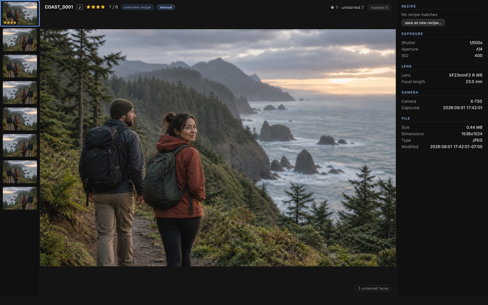

<p align="center">
  
</p>

<h1 align="center">Ember</h1>

<p align="center">
  Fast, durable, local-first photo culling for Fujifilm JPEG+RAF workflows on Apple Silicon.
</p>

<p align="center">
  <a href="https://github.com/CarsonLMH/Ember/actions/workflows/ci.yml"></a>
  
  <a href="LICENSE"></a>
</p>



> [!IMPORTANT]
> Ember is an early, source-build preview for Apple Silicon Macs. There is no
> signed or notarized public download yet. It is already used on real Fujifilm
> shoots, but contributors should expect sharp edges and evolving interfaces.

## Why Ember exists

Culling should be the quick, boring part after a shoot. Ember keeps it that way:
the next photo is ready before you ask for it, every rating is journaled before
the UI confirms it, and JPEG+RAF pairs behave as one photo.

The project has two deliberately unforgiving priorities:

1. A preloaded keypress-to-rendered flip has a p99 budget of **50 ms**.
2. A crash must not silently lose or alter a rating or trash verdict.

The implementation is optimized around those constraints—not around becoming a
general-purpose photo editor. See the [product specification](SPEC.md) and
[reproducible benchmark contract](docs/BENCHMARKS.md) for the exact boundaries.

## What it does

- Treats matching JPEG and RAF files as one logical photo, while supporting
  either format on its own.
- Rates in place by default, with optional auto-advance, durable undo/redo, and
  exact or “N stars and up” filtering.
- Sorts by capture date, filename, or rating; remembers the folder, filter,
  sort, position, and viewing layout.
- Moves both halves of a pair to the macOS Trash and reports a recovery path if
  the operating system prevents a rollback.
- Writes standard XMP ratings in the background: an atomic JPEG rewrite whose
  image payload is hash-checked in tests, plus a sidecar for RAF. **RAF files
  are never modified.**
- Reads Fujifilm MakerNotes for AF-point inspection and exact/set/range-aware
  film-recipe matching.
- Provides on-device face detection and recognition. Names, embeddings, and
  face crops stay local and can be deleted from the app.
- Keeps the photograph in an imperative canvas path; React renders the chrome,
  not the hot flip loop.

Press `?` in the app for the complete, grouped keyboard reference. `Shift+T`
enters picture-only immersion mode.

## Privacy and file safety

Ember has no account, cloud service, or built-in telemetry. Photo analysis and
face recognition happen locally. The build process does download normal package
dependencies and the pinned ONNX Runtime library.

Verdicts first enter an append-only SQLite journal. XMP updates drain from a
separate durable queue, so slow metadata work is kept out of the interaction
path. Trash uses the native macOS API and remains recoverable with **Put Back**.

Read [Privacy and local data](docs/PRIVACY.md) before using real photos in a
development build. The screenshot above uses a generated, fictional scene; its
fixtures and EXIF are synthetic.

## Build from source

### Requirements

- An Apple Silicon Mac
- Node.js 22.19.0 and npm 10.9.3 (declared in `.node-version` and `package.json`)
- Rust 1.97.1 through `rustup` (declared in `rust-toolchain.toml`)
- Xcode Command Line Tools
- [ExifTool](https://exiftool.org/)

The minimum supported macOS version has not been formally declared yet.

```sh
brew install exiftool
corepack enable npm
npm ci
npm run tauri dev
```

A release-mode application bundle can be built with:

```sh
npm run tauri build
```

Until signed releases exist, macOS may apply its normal protections to locally
built or downloaded unsigned applications.

## Architecture

Ember is a Tauri 2 application with a Rust core and React/TypeScript chrome.
Rust owns scanning, SQLite persistence, previews, metadata, XMP, and native file
operations. The frontend owns an explicit `ImageBitmap` cache and an imperative
canvas renderer. Images cross the boundary through an asynchronous `photo://`
protocol using opaque IDs—not base64 payloads.

Start with [Architecture](docs/ARCHITECTURE.md), then use the
[documentation map](docs/README.md) for the data model, face-system deviations,
model provenance, and historical design records.

## Verification

The fast local checks are:

```sh
npm run test:harness
npm test
npm run build
cd src-tauri && cargo test
```

Native E2E, accessibility, visual, durability, and real-photo performance gates
are documented in [Testing](docs/TESTING.md). Real-photo gates require an
explicit fixture path and must never be pointed at an irreplaceable library.

## Contributing

Contributions are welcome—especially focused fixes that preserve the flip-path
budget and verdict durability. Read [CONTRIBUTING.md](CONTRIBUTING.md) before
opening a pull request. It explains the test tiers, changelog rule, privacy-safe
fixtures, and why a seemingly harmless abstraction can still be expensive here.

Please use synthetic or clearly redistributable photos in issues, tests, and
screenshots. Do not publish personal photos, face labels, EXIF locations, or a
local Ember database. Security issues belong in the private route described in
[SECURITY.md](SECURITY.md), not a public issue.

## Project references

- [Product specification and roadmap](SPEC.md)
- [Architecture](docs/ARCHITECTURE.md)
- [Privacy and local data](docs/PRIVACY.md)
- [Benchmarks](docs/BENCHMARKS.md)
- [Bundled models](docs/MODELS.md)
- [Third-party notices](THIRD_PARTY_NOTICES.md)
- [Changelog](CHANGELOG.md)
- [Contributing](CONTRIBUTING.md)
- [Code of conduct](CODE_OF_CONDUCT.md)

## License and support

Ember is available under the [MIT License](LICENSE). If it saves your evening,
you can [buy the maintainer a roll of film](https://github.com/sponsors/CarsonLMH).
