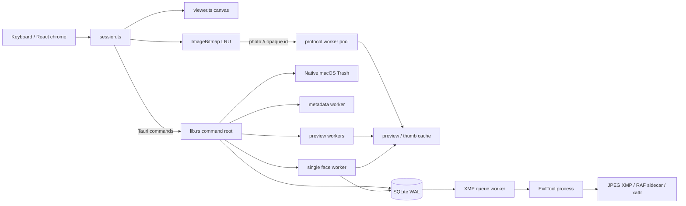

# Architecture

**Status: current architecture contract.** This page describes the checked-in
Tauri/Rust/React implementation. Product behavior and priority still come from
[`SPEC.md`](../SPEC.md); deliberate face-system changes are recorded in
[`FACES_DEVIATIONS.md`](FACES_DEVIATIONS.md). Files under `docs/reviews/` are
historical snapshots, not current architecture instructions.

## The constraints that shape the system

Ember is built around two hard priorities:

1. A preloaded photo flip must stay within a 50 ms p99 budget and serve from
   the owned bitmap cache in steady state.
2. A crash must not silently lose or alter an acknowledged verdict.

Those constraints explain the main split: Rust owns persistence, file I/O,
metadata, native operations, and background work; React owns application
chrome; and the pixel hot path stays in small imperative TypeScript modules
outside React rendering.

## Runtime map

All arrows are local to the Mac. The production application has no account,
cloud backend, or telemetry pipeline; see [Privacy](PRIVACY.md) for the exact
runtime and development-tool boundaries.

## Ownership by layer

| Area | Owner | Primary files |
|---|---|---|
| UI composition and chrome | React | [`src/App.tsx`](../src/App.tsx), [`src/components/`](../src/components/) |
| Culling session, navigation, sort/filter, preload policy | Imperative TypeScript | [`src/lib/session.ts`](../src/lib/session.ts), [`src/lib/order.ts`](../src/lib/order.ts) |
| Pixel rendering and zoom | Imperative canvas | [`src/lib/viewer.ts`](../src/lib/viewer.ts) |
| Decoded-pixel lifetime | Explicit `ImageBitmap` LRU | [`src/lib/imageCache.ts`](../src/lib/imageCache.ts) |
| Frontend/backend contract | Typed Tauri invokes and events | [`src/lib/ipc.ts`](../src/lib/ipc.ts), [`src-tauri/src/lib.rs`](../src-tauri/src/lib.rs) |
| Folder scan and JPEG+RAF pairing | Rust | [`scanner.rs`](../src-tauri/src/scanner.rs) |
| Durable verdict state and action journal | SQLite | [`store.rs`](../src-tauri/src/store.rs) |
| Preview generation and local image serving | Rust worker pools | [`preview.rs`](../src-tauri/src/preview.rs), [`protocol.rs`](../src-tauri/src/protocol.rs) |
| Metadata and external writes | Rust plus one shared persistent ExifTool child | [`metadata.rs`](../src-tauri/src/metadata.rs), [`xmp.rs`](../src-tauri/src/xmp.rs) |
| Native trash and restore | Rust/AppKit foundation APIs | [`trash.rs`](../src-tauri/src/trash.rs) |
| Face detection, recognition, and persistence | One ONNX worker plus guarded SQLite writes | [`faces.rs`](../src-tauri/src/faces.rs), [`facedet.rs`](../src-tauri/src/facedet.rs), [`facestore.rs`](../src-tauri/src/facestore.rs) |

`src-tauri/src/lib.rs` is the composition root. New persistence logic belongs
in the store modules, external metadata writes in `xmp.rs`, and preview or
protocol behavior in their named modules rather than accumulating in the
command layer.

## Folder-open and display flow

1. `session.openFolder` starts the folder-open timer and invokes
   `scan_folder`.
2. `scanner.rs` walks recursively, ignores dot-prefixed entries, follows and
   canonicalizes symlinked directories, and groups JPEG/RAF files by
   `(directory, case-insensitive stem)`. A pair or singleton becomes one
   logical photo with an opaque path-derived ID.
3. The store opens the folder record, reconciles external Finder restores,
   synchronizes photo rows, adopts existing ratings where appropriate, and
   returns the saved sort/filter/cursor state.
4. The frontend requests the current photo through the decoded bitmap cache.
   `photo://preview/<id>` serves a generated preview when ready; a miss falls
   back to `photo://orig/<id>` so first display does not wait for the sweep.
5. The `ImageBitmap` is owned by the frontend LRU and drawn synchronously to
   the canvas. React does not render the photograph.
6. A forward-biased preload window (eight ahead, three behind, mirrored when
   moving backward) fills the bitmap cache and updates the Rust worker anchor.

The custom protocol accepts hexadecimal opaque IDs, serves cache files through
a fixed worker pool, sets `Cache-Control: no-store`, and leaves decoded-frame
caching to `imageCache.ts`. Evicted `ImageBitmap` instances are explicitly
closed.

## Verdict and metadata durability

### Ratings and tags

A rating or tag change crosses one Tauri command and one SQLite transaction:

1. Verify that the photo belongs to the active folder.
2. Update the materialized photo row.
3. insert an action record and prune an abandoned redo branch.
4. Replace the photo's durable XMP-queue row with a new monotonic job token.
5. Commit under SQLite `WAL`, `synchronous=FULL`.
6. Only then resolve the command, allowing the UI to acknowledge the verdict.

The product calls this the append-only action journal. The implementation also
marks actions undone and removes an abandoned redo branch; the durable promise
is that every acknowledged transition is transactionally recorded and
replayable, not that the database file only ever receives SQL `INSERT`s.

The XMP worker trails the journal. It writes `xmp:Rating`, `dc:subject`, and the
macOS star xattr, then compare-deletes exactly the queue job it completed. A
later edit gets a new job token, so an old completion cannot erase newer work.
Failures retry and eventually remain visibly parked rather than disappearing.
On normal quit, Ember waits up to five seconds for pending jobs; undrained jobs
resume next launch. The exact external-file contract is in
[`METADATA.md`](METADATA.md).

### Trash and restore

Trashing is necessarily a filesystem-first operation:

1. Move the JPEG to the system Trash through `NSFileManager`.
2. Move the RAF. If that fails, attempt to restore the JPEG before returning.
3. Record the original and Trash paths plus the action in SQLite.
4. Acknowledge only after that record commits.

If macOS refuses the rollback, Ember cannot manufacture physical pair
atomicity. The operation fails loudly with both errors and the paths needed for
manual recovery; it never reports the JPEG as restored when it was not.
Restore and undo likewise perform filesystem effects before changing journal
state, tolerate a half already put back through Finder, and attempt to roll
back only the half moved by the current call.

## Background work and contention boundaries

- Six preview workers generate oriented screen-size previews and thumbnails,
  prioritized around the current cursor. RAF display extraction may spawn
  short-lived local ExifTool commands for its embedded JPEG.
- Six protocol workers bound cache-file reads and keep disk I/O off WebKit's
  URI-scheme callback thread.
- One metadata worker and the XMP queue share one serialized, persistent
  ExifTool process for MakerNote reads and metadata updates.
- One XMP queue worker performs external metadata writes away from the flip
  path.
- One face worker uses its own SQLite connection, one ONNX intra-op thread,
  and only claims photos whose previews exist. Model hashing and initialization
  are deferred until eligible work exists.
- An optional focus worker derives AF-patch sharpness from cached previews.
- A once-per-launch cache janitor prunes old folder groups, never the folder
  active in the current session.

Cursor-prioritized background work is allowed to be eventually consistent.
It may not delay journal acknowledgement or enter the framework-free flip path
without measured evidence.

## Face data flow and concurrency contract

The face pipeline is preview-only: detect with YuNet, align and embed with
SFace, compare against user-confirmed exemplars, and commit through guarded
SQLite transactions. Names, rectangles, embeddings, rejections, scan status,
and model-generation identity stay in SQLite; they are not verdicts and do not
enter the rating undo journal.

The worker uses a preview-generation token to discard superseded pixels before
the final write. Every scan commit then rechecks the enabled state, indexing
epoch, model generation, source identity, and face revision inside its SQLite
transaction. Stale work is discarded instead of winning over a user edit.
Model ownership is ordered by the monotonic `MODEL_RELEASE` rank before a job
is claimed; two instances of the same installed build may share the database.
Concurrent pre-rank/schema-v5-or-older binaries are explicitly unsupported.

Face crops are encoded in memory. The only disk publication path is
`facestore::publish_chips`, which takes SQLite's writer lock, rechecks epoch and
scan revision, validates the complete expected artifact set, and then writes
revisioned cache files. A privacy deletion either follows a completed publish
and sweeps it, or commits first and causes the later publish to refuse. The
full deletion protocol and its limits are documented in
[`PRIVACY.md`](PRIVACY.md).

## Local storage map

| Location | Purpose | Regenerable? |
|---|---|---:|
| `~/Library/Application Support/com.cleung.ember/ember.sqlite3` plus SQLite WAL/SHM files | Folder state, journal, queues, metadata, focus and face data | No: contains the durable session record |
| Same Application Support directory: `settings.toml`, `keymap.toml`, `recipes.toml`, `tags.toml` | Human-editable configuration | User-authored |
| Same directory: `perf-reports/` | Local flip benchmarks and face-calibration reports | Yes; calibration reports can contain person names/IDs and are removed by **Delete all face data** |
| `~/Library/Caches/com.cleung.ember/previews/` | Previews, thumbnails, exposure artifacts, RAF display extracts, and revisioned face chips | Yes |
| `~/Library/WebKit/com.cleung.ember/` | WKWebView website data, including Ember's `localStorage` UI preferences | Yes; macOS/WebKit-managed |
| `~/Library/Preferences/com.cleung.ember.plist` | Native open-panel and window preferences; may retain the last browsed directory | Yes; macOS-managed |
| `~/Library/Saved Application State/com.cleung.ember.savedState/` | Native window-restoration state | Yes; macOS-managed and not present on every system |
| User-selected photo folders | Source JPEG/RAF files and XMP sidecars | User data |
| macOS system Trash | Recoverable trashed source files | Managed by macOS |

See [Privacy](PRIVACY.md) before inspecting, copying, or publishing any of
these locations.

## Change rules

- Keep full-resolution decode out of normal flips; it belongs to zoom mode.
- Do not replace `photo://` with base64 or large IPC payloads.
- Keep canvas pixels outside React and close evicted bitmaps explicitly.
- Never modify a RAF; write its `.xmp` sidecar.
- Route every verdict through the journal-backed command path.
- Preserve pair-aware trash/restore and surface partial OS outcomes honestly.
- Bump `MODEL_RELEASE` whenever a face model or embedding preprocessing changes.
- Treat the three face privacy invariants in `AGENTS.md` as load-bearing.
- Run the test tier appropriate to the changed boundary; see
  [`TESTING.md`](TESTING.md).
